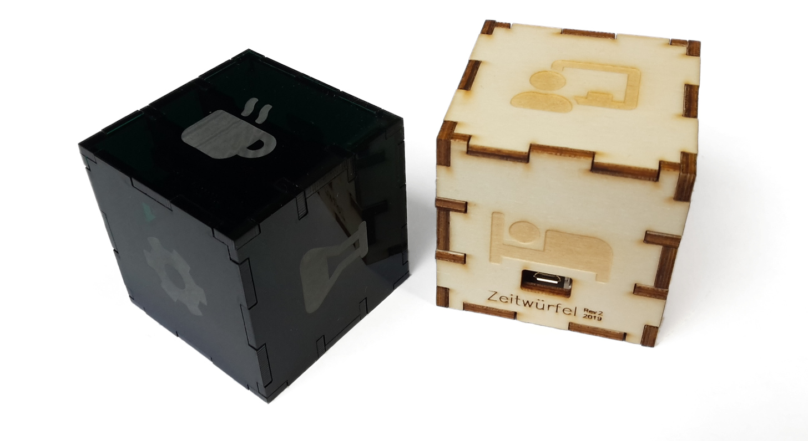
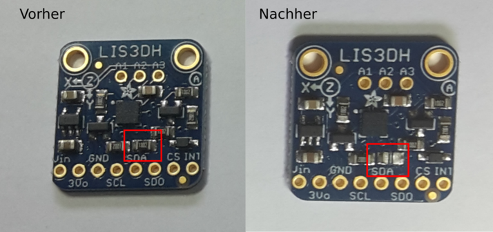
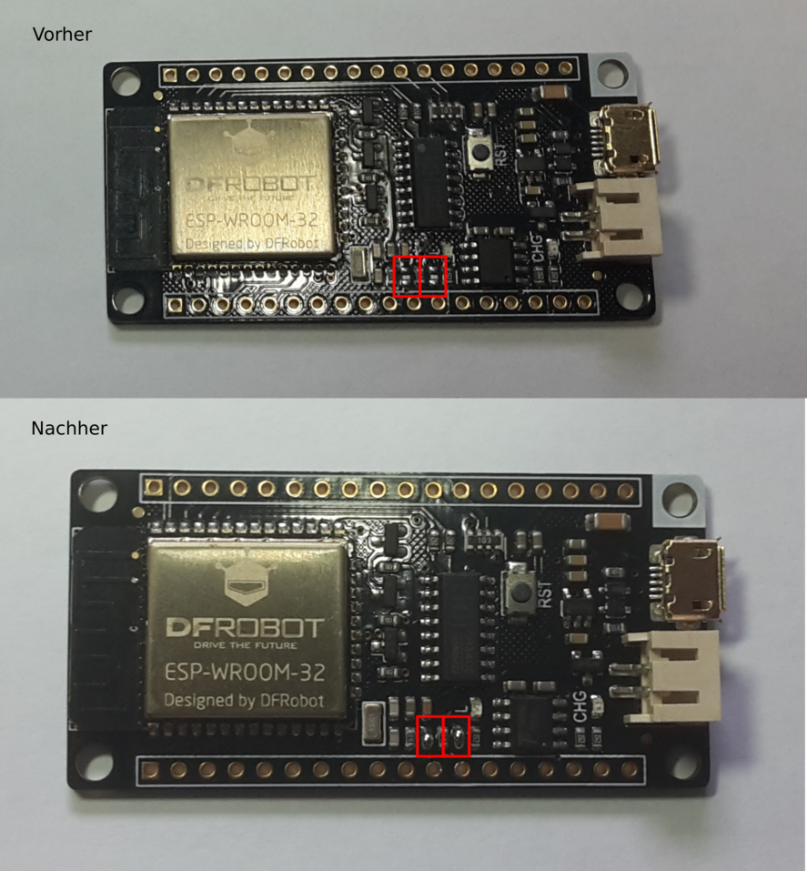
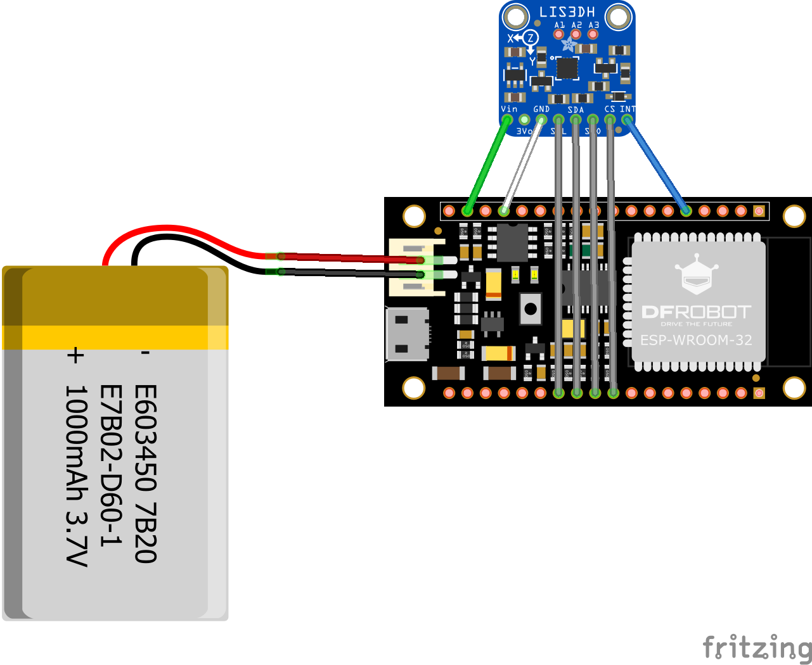
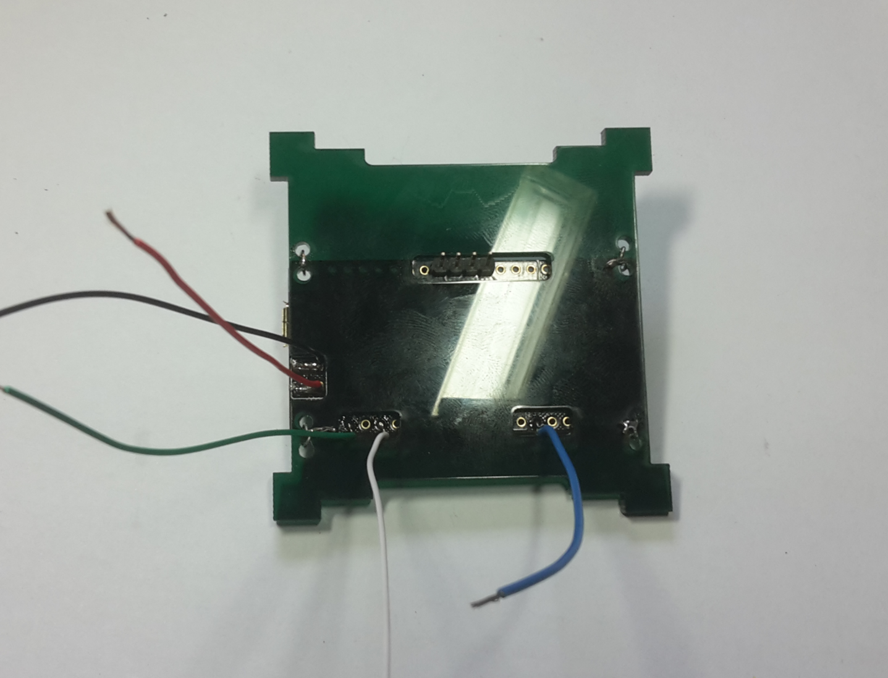
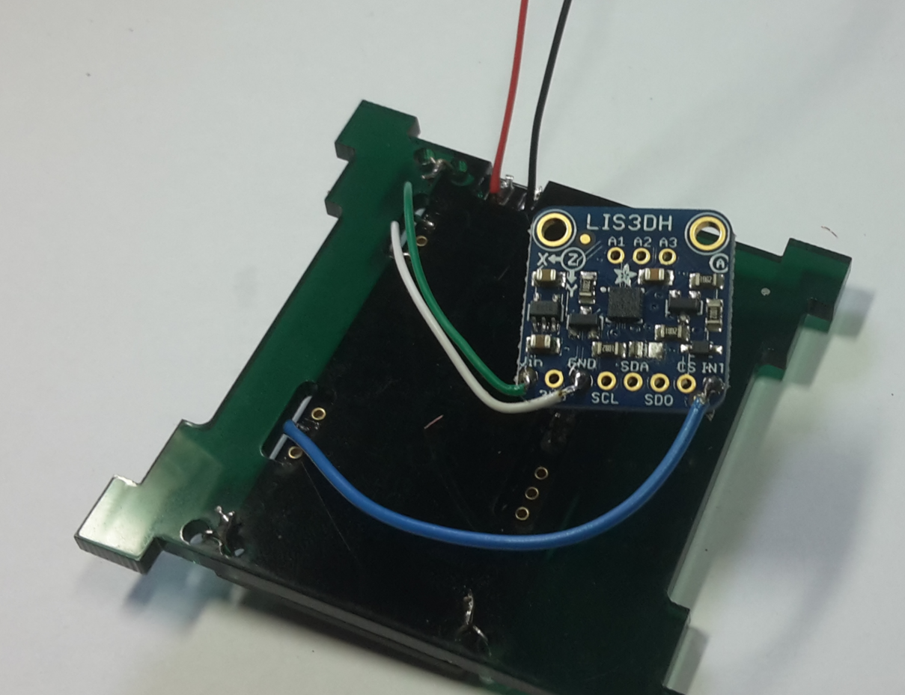
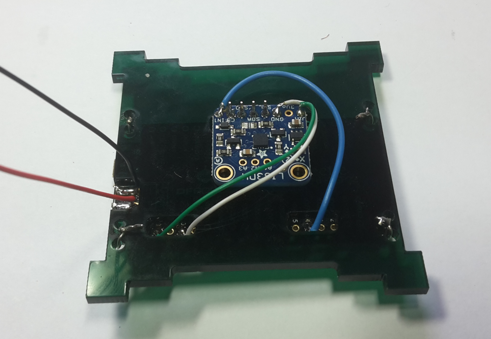
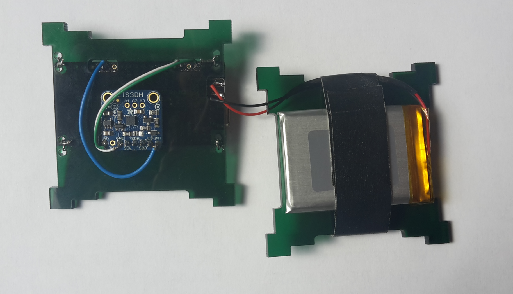

Montageanleitung
-----------------

### Gehäuse

Der Würfel kann je nach Belieben aus Acryl oder Holz (Sperrholz) angefertig werden.
Es gibt Vorlagen für den Lasercutter für [3mm](lasercut-firebeetle-3mm.svg) und [4mm](lasercut-firebeetle-3mm.svg) Materialdicke.
Bei der Verwendung von Sperrholz können für die Befestigung des Mikrocontrollers Eisenschrauben verwendet werden, bei Acryl sollten entweder Plastikschrauben verwendet werden oder zusätzliche Löcher hinzugefügt werden, um eine Befestigung mit Draht zu ermöglichen.

### Bauteile

  * ESP32 Mikrocontroller mit Ladeelektronik [DFRobot FireBeetle ESP32 (Rev. 3)](https://www.dfrobot.com/product-1590.html); ca. 17 Euro bei [Mouser](https://www.mouser.de/new/dfrobot/dfrobot-firebeetle/)
  * 3-Achsen Beschleunigungssensor [Adafruit LIS3DH](https://www.adafruit.com/product/2809); ca. 5 Euro bei [EXP Tech](https://www.exp-tech.de/sensoren/beschleunigung/6790/adafruit-lis3dh-triple-axis-accelerometer-2g/4g/8g/16g)
  * 3.7V Lithium-Polymer-Akku (z.B. mit 1000mAh); ca. 6 Euro bei [EXP Tech](https://www.exp-tech.de/zubehoer/batterien-akkus/lipo-akkus/5801/lipo-akku-1000mah-3.7-v-2-mm-jst)

### Vorbereitung Firebeetle und LIS3DH

  * Beim *LIS3DH* den Widerstand `R1` (rechts über den Text `SDA`) herauslöten, da dieser unnötig Strom verbraucht ([vgl. Diskussion im Adafruit Froum](https://forums.adafruit.com/viewtopic.php?f=19&t=107822#p539250)).

  * Die Lötbrücken (im [Schema](https://images-na.ssl-images-amazon.com/images/I/A1VO7RyKHzL.pdf) verwirrender Weise als 0 Ω Widerstand `R10` und `R11` bezeichnet) beim *FireBeetle* verbinden, damit der bereits vorhandene Spannungsteiler zum Messen der Batterie verwendet werden kann.

### Zusammenbau

  * Am *FireBeetle* werden an folgenden Anschlüssen Kabel angelötet:
    * Batterie positiv
    * Batterie negativ
    * Ground `GND`
    * 3.3 Volt `3V3`
    * `IO27/D4`
  * Eine Stifleiste mit 4 Pins wird zudem an folgende Anschlüsse angebracht:
    * `SCK/IO18`
    * `MOSI/IO23`
    * `MISO/IO19`
    * `SDA/IO21`

  * Das Board wird dann mit den Anschlüssen nach unten in die gelochte Innenplatte gelegt. Die Kabel werden dabei durch die Platte gezogen.

  Das Board sollte an der Platte befestigt werden, z.B. mit kleinen Schrauben oder etwas Draht.

  

  * Der *FireBeetle* wird nun mit dem *LIS3DH*  verbunden:
    * `3V3` auf Eingang Versorgungsspannung `Vin`
    * `GND` mit `GND` verbinden
    * `IO27/D4` auf Interrupt Pin `INT`

  * Anschliessend wird die Stifleiste mit den *LIS3DH*  mit den SPI-Anschlüssen `SCL`, `SDA`, `SDO` und `CS`
    verbunden und das Board somit ebenfalls fixiert.

  * Die Batterie mit den verbleibenden Kabeln vom *FireBeetle* verbinden (**dabei auf die Polung achten!**).
  Die Batterie auf der zweiten Innenplatte fixieren, z.B. mit etwas Klebeband.

  * Den Würfel zusammensetzen und abschliessend mit Kleber fixieren.
